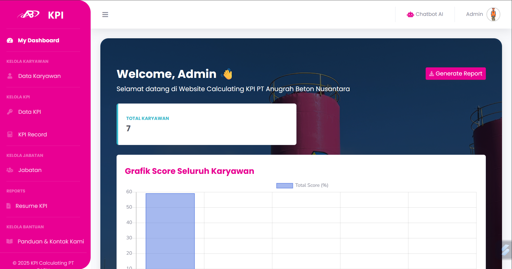

# 📊 Calculating KPI PT Anugrah Beton Nusantara

Aplikasi **Calculating KPI** ini dirancang untuk memudahkan pengelolaan dan perhitungan **Key Performance Indicator (KPI)** karyawan di PT Anugrah Beton Nusantara.  
Fitur utama mencakup **Pengelolaan Data Karyawan**, **Pengelolaan Data KPI**, **perhitungan KPI otomatis**, **pengelolaan data jabatan**, **laporan KPI lengkap**, hingga **chatbot panduan penggunaan aplikasi**.
---
🖼 Tampilan Aplikasi
<p align="center"> <br> <i> Tampilan Dashboard Admin</i> </p> <p align="center"> <br> <i>Tampilan Menu Utama</i> </p> </p> <p align="center"> <br> <i>Tampilan Menu Resume</i> </p>

---
## 👨‍💻 **Dikembangkan Oleh**
<p align="center">  </p> <h3 align="center">Ahmad Fachri Albar</h3> <p align="center"> <b>Mahasiswa Program Studi Sistem Informasi</b><br> <b>Telkom University Purwokerto</b> </p> <p align="center"> <a href="https://github.com/ahmadfachrialbar" target="_blank">  </a> <a href="mailto:ahmadfachri846@gmail.com" target="_blank">  </a> <a href="https://www.linkedin.com/in/ahmad-fachri-albar-98a135273/" target="_blank">  </a> </p>

## 🚀 **Fitur Utama**

### 🔹 **Role dan Hak Akses**
1. **Admin**
   - CRUD data User, karyawan, jabatan, dan KPI metrics dan fitur lainnya.
   - Melihat laporan KPI semua karyawan.
   - Mengelola profil pribadi.
2. **Karyawan**
   - Menghitung KPI secara mandiri.
   - Melihat laporan KPI pribadi.
   - Mengedit profil.
3. **Direksi**
   - Melihat Data Karyawan dan laporan KPI semua karyawan (read-only).
4. **Chatbot Panduan**
   - Semua role dapat mengakses chatbot untuk panduan penggunaan aplikasi.

---

## 🗂 **Struktur Fitur yang Diuji (Whitebox Testing)**

Semua controller telah diuji menggunakan **PHPUnit** dengan pendekatan **whitebox testing**.  

## 🧪 **Hasil Pengujian**

Seluruh pengujian dilakukan menggunakan **PHPUnit** di Laravel.

| Controller | Jumlah Test | Status |
|------------|-------------|--------|
| JobPositionController | 5 | ✅ Pass |
| KpiMetricController | 7 | ✅ Pass |
| HitungKpiController | 7 | ✅ Pass |
| KpiRecordController | 2 | ✅ Pass |
| ProfileController | 5 | ✅ Pass |
| FaqController | 4 | ✅ Pass |
| DashboardController | 3 | ✅ Pass |
| ChatbotController | 3 | ✅ Pass |

Total: **36 test case** – **100% Passed ✅**

---

## 🛠 **Instalasi dan Menjalankan Project**

### 1. Clone Repository
```bash
git clone https://github.com/ahmadfachrialbar/Calculating_KPI.git
cd Calculating_KPI
```
### 2. Install Dependensi
```bash
composer install
npm install && npm run dev
```
### 3. Salin .env
```bash
cp .env.example .env
```
### 4. Migrasi Database dan Seeder
```bash
php artisan migrate --seed
```
### 5. jalankan Server
```bash
php artisan serve
Akses di http://localhost:8000
```
## 👨‍💻 **Teknologi yang Digunakan**
1. **Framework & Bahasan Pemrograman**
   - Laravel 10 (sebagai framework utama backend & frontend Blade)
   - PHP 8.x (bahasa pemrograman)
   - Blade Template Engine (untuk tampilan UI)
2. **Database**
   - Mysql.
3. **Autentikasi & Role Management**
   - Spatie Laravel Permission (untuk manajemen role: admin, karyawan, direksi)
4. **Frontend & UI**
   - Bootstrap
   - Font Awesome & Icons
   - SweetAlert2 / Notify
   - DataTables
   - Chart.js
   - PhpSpreadsheet
   - DOMPDF / Laravel Snappy 
4. **Tools & Environment**
   - Composer
   - FonArtisan CLI
   - Visual Studio Code
   - Git dan Github
   - XAMPP

---

